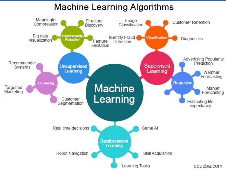

# Insurance Data Studio Tutorial

## Prerequisites

Before you start this tutorial you should watch this videos:

1. [IBM Watson Studio | Machine Learning with Zero Code](https://www.youtube.com/watch?v=uri0xywEEvM). This video tutorial explain the use case I am explaining in this tutorial. However, the video is incomplete and the user interface changed a lot.

## Goal

This tutorial will teach you how to use Regression to forecast values based on a spervised training set. In this scenario we have a csv with a list of people data like this:

* age
* sex
* bmi
* smoke
* children
* region

based on these data there is an additional field that report how much the person is charge by insurance company. The goal is that using this data and created a machine learning model 
published online you can provide the info above for a given person and the model will predict how much it should be charged.

## About Regression model

The Regression Model is a vital component of supervised machine learning, focused on predicting continuous values by establishing relationships between input features and a target variable. It seeks the best-fitting line or curve that minimizes prediction errors. Variants include Linear and Polynomial Regression. Through training on data and subsequent testing, the model aids in making informed predictions, especially relevant in finance and healthcare. Regularization techniques can enhance its generalization ability. Overall, the Regression Model is a powerful tool for precise numerical forecasting and data-driven insights.

## Create the AI experiment

This tutorial assume you have already instantiated Watson Studio in your IBM account.
Here the steps to create the project. 

1. From the Watson Studio home page click on Build and Manage ML models.
2. In the Dialog box select Provision Watson Machine Learning option and click the Next button.
3. Left the Watson Machine Learning default values and click on the Create button.
2. In the Dialog box select New Project.
3. Call the new project "InsuranceTutorial" and click on the Create button.
4. Associate to this project the Machine Learning Service. Click on Manage Tab and then select Services & Integration, then click on the Associate Service button, select the Watson Machine Learning service and click on the Associate button.
5. On the Asset tab click on the New Asset button, select the AutoAI builder.
6. In the "Create an AutoAI experiment" page enter "InsuranceAIExperiment" as name and click the Create button.
7. In the "InsuranceAIExperiment" page add the [insurance.csv](insurance.csv) file.
8. In the "Configure details" the tool ask "Create a time series analysis?", click on "No" button.
9. The page then ask "What do you want to predict?", select the "charges" field.
10. Click on the "Run experiment" button.
11. Wait until the experiment completes. It takes some time.
12. In the "Pipeline leaderboard" select one of the pipelines and save it clicking on the "Save as" button.
13. Save it as a Model selecting the "Model" box and clicking on the Create button.
14. A successful message will appear, click on the "View in the project" link.
15. Click on the "Promote to deployment space" button.
16. Select the space where to promote the experiment. Click on the Promote button.
17. A successful message will appear. Click on the "deployment space" link.
18. In the Space the Model will appear. Click on the 3 dots and select "Deploy".
19. Select the "Online" option and enter the deploy name "InsuranceTutorialOnline".
20. Wait until the model is deployed into the space.
21. Once the deploy is ready you can use curl, Java code, Python code to test it. The easiest way to test it is clicking the Test tab.

## Run a Test

1. Insert the values for the fields:
* age
* sex
* bmi
* smoke
* children
* region

2. The model will predict the charges for that person.

